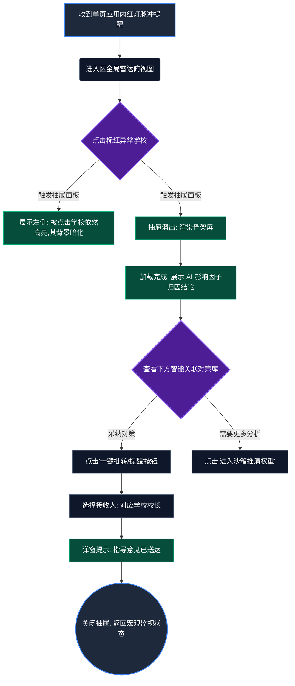
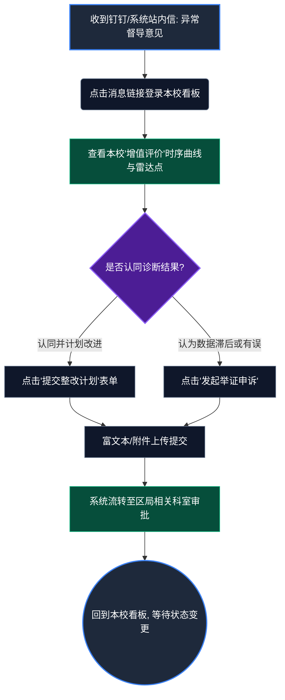
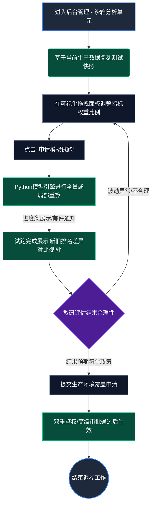

# UX Design Specification bmad-test

**Author:** centron
**Date:** 2026-03-03T12:56:00+08:00

---

<!-- UX design content will be appended sequentially through collaborative workflow steps -->

## 执行摘要 (Executive Summary)

### 项目愿景 (Project Vision)

为区域教育系统打造一个智能、富有共情能力的“领航员”，以动态的“增值评价模型 (VAM)”取代传统的唯分数论排名。该系统将通过高性能的下钻式决策驾驶舱和直观的算法沙箱，为各级教育管理者提供深度、可落地的可执行洞察。

### 目标用户 (Target Users)

1. **市级教育局管理者：** 需要宏观的可视化监管（热力图）来识别系统性趋势，并公平地分配教育资源。
2. **区县教育局局长：** 依赖智能的根因预警和雷达图来诊断薄弱学校，并精准实施干预措施。
3. **中学校长：** 需要在一个安全、匿名的环境对比本校与同类学校的历史发展轨迹，以了解真实的“增值”进步情况，避免公开排名带来的羞耻感。
4. **教研员/系统管理员：** 需要一个专业的拖拽式沙箱环境，来模拟配置复杂的算法权重并发布生效。

### 核心设计挑战 (Key Design Challenges)

- **控制认知负荷：** 在展示高密度、多维度数据（例如雷达图、历史轨迹）的同时，必须保持关键“红绿灯”预警的绝对醒目。
- **复杂的导航架构：** 需要为“市 -> 区县 -> 学校”的下钻操作设计精准的交互模型，确保在此类无缝切换中用户不会迷失空间和层级感。
- **抽象的配置界面可视化：** 将复杂的算法权重调参过程转化为直观、非技术向的“沙箱”滑动条/拖拽式界面供教研员使用。

### 设计机遇 (Design Opportunities)

- **富有共情能力的视觉语言：** 采用更柔和、以诊断性质为主的 UI 界面模式，将数据展示为“需要支持”而非“不及格”，契合项目赋能薄弱学校的初衷。
- **即时的行动转化力：** 将“系统预警 -> 根因分析 -> 知识库解决方案”的路径设计在一个无缝关联的平行上下文中，极大缩短管理者的决策响应时间。

## 核心用户体验 (Core User Experience)

### 定义核心体验 (Defining Experience)

系统中最核心、最高频的交互是**“发现异常 -> 探索归因 -> 获取对策”的诊断全链路**。
对于各级教育局管理者而言，最核心的动作是打开大屏时，系统已将“需要关注的红灯区/校”和“同类偏离轨迹”直观地推送到眼前。如果这条链路做到极致，管理者不再需要去庞杂的报表里捞数据，而是直接看结论和系统给出的智能归因，这将彻底释放这套系统的业务价值。

### 平台策略 (Platform Strategy)

- **主要平台：** 桌面端 Web 决策大屏（PC Web），基于 Vue 3 (Vben Admin 框架)。
- **交互方式：** 以鼠标为主的大屏交互，依赖精准的 Hover（如悬浮透出脱敏统计特征）和 Click（市->区->校级的层层下钻）。
- **性能红线：** 受 NFR 严格约束，高空间密度的数据在首屏或层级下钻切换时，必须能在 3 秒内完成渲染，这意味着体验上必须做到“骨架屏+局部数据流式刷新”，坚决避免白屏等待和整页重载。

### 毫不费力的交互 (Effortless Interactions)

- **丝滑的视图下钻：** 从市级热力图点击某区县，应该是一个平滑的缩放或渐变过渡动画，直接将其就地展开为对应辖区的雷达图，保持用户的视觉焦点和空间方向感。
- **一键获取解药：** 当雷达图亮起“红灯”预警时，导致其失分的根因（例如“睡眠质量骤降”）应自动高亮标出，且与之匹配的对策文档链接应直接展示在预警卡片旁边。用户不需要去“知识库”模块另行搜索，阅读指导对策就在当前的上下文中“毫不费力”地一键弹窗完成。
- **匿名的安全基线对比：** 当校长查看本校成长轨迹时，同类学校的参考基线是由系统在背景算好并叠加显示的。校长“毫不费力”就能直观了解本校的发展速度差异，且没有任何越权泄露他校数据的风险。

### 关键成功时刻 (Critical Success Moments)

- **顿悟与信任时刻 (Trust & Aha Moment)：** 当区县局长看到一所学校得分下降，点击红灯后，系统不仅指出下降原因，还附带了醒目的“算法置信度说明”和人工修改测评数据的“介入标记(✋)”。这种透明度会让管理者瞬间建立对这套 AI 评价引擎的信任。
- **掌控时刻 (Control Moment)：** 教研员在沙箱里拖拽调整某项教育指标的权重，点击“试跑”，很快能在暂存视图里看到新的模拟排名。这种所见即所得的反馈感决定了算法实施的成败和教研员的使用意愿。

### 体验原则 (Experience Principles)

1. **宏观到微观的无缝衔接 (Seamless Macro-to-Micro):** 永远不让用户在层级钻取时迷失，通过动效保持空间上下文锚点。
2. **结论先行，解药紧随 (Conclusion First, Solution Follows):** 预警不仅要亮起，对应的负面归因和知识库引导策略必须在同一视觉层级内触达（One-click away）。
3. **赋能而非惩罚 (Empowerment over Punishment):** 大屏的用词和色彩应优先传达“发展轨迹识别”与“需要干预支持”，避免绝对排名展示带来的压迫感和羞耻感。
4. **性能即体验 (Performance is Experience):** <3秒的局部渲染底线绝不妥协，无阻塞的数据加载是保持沉浸感的基石。

## 期望的情感响应 (Desired Emotional Response)

### 核心情感目标 (Primary Emotional Goals)

- **主导情感：信任与掌控感 (Trust & Empowerment)**
  用户应该感到这套系统是来“帮忙查漏补缺和赋能”的，而不是“高高在上发榜单通报批评”的。通过完全透明的算法解释和对策支持，让用户觉得“数据是他们手中的工具”。

### 情感旅程映射 (Emotional Journey Mapping)

- **第一眼看到大盘时：清晰且专注 (Clear & Focused)**：复杂的区域热力图不应该让人眼花缭乱，而应让市级管理者立刻明确“今天我的注意力应该放在哪里”。
- **当出现预警（亮红灯）时：警觉而非恐慌 (Alert but not Panicked)**：用清晰明确的视觉传达问题（例如微弱脉冲红圈提示），而不是刺眼的闪烁。
- **查看归因与对策时：释然与自信 (Relieved & Confident)**：当用户点开红灯，立刻看到“原来是因为 X 指标下降，这里有一份应对方案”，此时他们会从“发现问题的焦虑”瞬间转变为“掌握解决路径的自信”。
- **沙箱调参试跑完时：掌控与成就感 (In Control)**：教研员能清晰看到自己的参数调整如何影响了全局基线，感受到对评价体系强有力的掌控能力。

### 微表情与微情感 (Micro-Emotions)

- **信任而非怀疑 (Trust vs. Skepticism)：** 提供算法产生的来源依据（置信度标签、人工补录角标(✋)），消除“这分数怎么算出来的，是不是有黑箱操作”的疑虑。
- **安全而非暴露 (Safe vs. Exposed)：** 校长在看本校轨迹时，知道其他学校的数据对他是屏蔽的，且他本校的数据在市局那里也是有“客观前置归因”的（不是一味指责），这会建立数据使用上的安全感。
- **高效而非繁琐 (Efficient vs. Frustrated)：** 从预警直接点击弹出“知识库对策文档”的丝滑弹窗体验，消除去别的模块按关键字搜索的烦躁感。

### 设计启示 (Design Implications)

- **视觉色彩倾向：** “红绿灯”的色彩使用需要克制。警示色（红/黄）应当用于小面积的高光和徽标，大面积的背景和雷达图基台应当使用平和的深邃蓝/中性灰，以平复情绪。
- **微动效说明：** 任何引发系统后台重算的动作（如沙箱“试跑”），都必须伴随明确的 Loading 骨架屏或进度条，不能让用户产生“系统是不是卡死了”的焦虑等待。这与 NFR 中规定的 30 分钟批处理任务、3 秒前端渲染相互呼应。
- **文案情感色彩 (Micro-copy)：** 绝对避免使用带有强烈负面或审判色彩的词汇（如“差”、“落后”、“不合格”），替换为建设性词汇（如“需关注”、“偏离同级基线”、“存在下行风险”）。

### 情感设计原则 (Emotional Design Principles)

- **成为向导，而非判官 (Be a Guide, Not a Judge)。**
- **永远不要指出问题而不给线索 (Never highlight a problem without offering a clue)。**

## UX 模式分析与灵感借鉴 (UX Pattern Analysis & Inspiration)

### 启发性产品分析 (Inspiring Products Analysis)

为了打造极致的决策大屏，我们将从以下顶级 B2B 系统中汲取灵感：

1. **Datadog / Grafana (监控与告警领域)**
   - *亮点：* 它们能在同屏展示极其海量的时间序列数据，却依然能让“告警（Alerts）”在第一时间穿透视觉噪音。
   - *借鉴点：* 当系统稳定时，所有图表都是沉寂的（暗色或统一单色）；一旦某个服务崩溃，该区域的卡片边缘会呈现具有呼吸感的红色发光，且点击这处红光，边栏会直接抽屉式滑出包含“错误日志”和“知识库解决方案”的排查链路。
2. **Tableau / 帆软平台 (复杂数据下钻)**
   - *亮点：* 提供无缝的“联动筛选”与“维度下钻”体验。
   - *借鉴点：* 当你在柱状图上点击某一个区县，页面上其他所有的雷达图、折线图都会平滑变形（动效过渡）过滤为该区县的数据，而不是生硬地白屏刷新一次页面。
3. **Vercel Dashboard (现代化配置交互)**
   - *亮点：* 将复杂的开发者工程配置做成了极简、甚至带有一丝“性冷淡风”的开关和卡片。
   - *借鉴点：* 我们为教研员设计的“算法沙箱”不应该像传统的复杂参数表一样填入生硬的百分比数字，而是可以借鉴其极其优雅的拉杆（Sliders）动画和即时的“实时预览（Live Preview）”效果。

### 可迁移的 UX 模式 (Transferable UX Patterns)

**导航与结构模式：**
- **抽屉式侧边栏展出 (Off-canvas Drawer)：** 适用于“大屏预警 -> 点击查看知识库对策”的场景。不要跳转新页面，大屏保持在底层不动，对策文档从右侧平滑滑出，用户看完关闭，立刻回到工作流。

**数据交互模式：**
- **渐进式的数据披露 (Progressive Disclosure)：** 在校级雷达图上，默认只展示“学业”、“健康”等5个一级纬度。只有当用户 Hover（悬停）在“健康”节点上时，才像树枝一样顺滑展开“视力评分”、“睡眠评分”等次级归因。

**视觉与告警模式：**
- **脉冲式高亮预警 (Pulse Highlight)：** 放弃整块变红的刺眼设计，当某个区域亮起红灯时，在包含该区的卡片角标增加一个缓慢呼吸的红点，这既能 100% 吸引眼球，又足够克制，符合“赋能诊断”的基调。

### 应避免的反面模式 (Anti-Patterns to Avoid)

- **“圣诞树”大屏效应 (The "Christmas Tree" Dashboard)：** 常见于大量劣质政务大屏项目，为了炫技把每个饼图、柱状图都涂成不同的高饱和度荧光色（红黄蓝绿紫全上），导致真正亮起红灯预警时，用户根本无法察觉（被淹没在色彩噪音中）。
- **死胡同弹窗 (Dead-end Modals)：** 使用系统原生的、居中的、阻断式的提示框（如：`alert("该校存在预警风险")`）。这种提示打断了用户的探索流，且往往除了一个“确定”按钮外，不提供任何前往修复问题的快捷链接。
- **无状态反馈的等待 (Stateless Waiting)：** 当触发由 Python 引擎支撑的“沙箱试跑”时，前端没有任何 Loading 或预估时间提示。让用户盯着屏幕干等，会诱发大量重复点击，甚至导致系统崩溃。

### 灵感设计策略 (Design Inspiration Strategy)

**我们决定采纳 (What to Adopt):**
- 采纳 **Datadog 的抽屉式根因分析结构**，实现从预警到对策的无缝衔接。
- 采纳 **Grafana 的脉冲式异常点高亮视觉**，确保在复杂雷达图面上预警信息的穿透力。

**我们决定改造 (What to Adapt):**
- 对 **Vercel 的高冷配置界面** 进行改造，使其更符合教研人员（非开发者）的认知模型，加入更清晰的“草案(Draft)”与“生产(Prod)”环境对冲对比图。

**我们坚决抵制 (What to Avoid):**
- 坚决避免任何滥用高保真多色彩块的**“圣诞树政务大屏”**风格，全系统的主色调（Data Ink Ratio）必须被严格控制，只把彩色留给关键结论和极性偏差。

## 设计系统基础 (Design System Foundation)

### 设计系统选择 (Design System Choice)

**强依赖选型：[Ant Design Vue] + [Vben Admin 深度定制主题] + [Tailwind CSS]**

考虑到本项目的核心是一个高密度数据承载的 B2B 后台驾驶舱，且架构已锁定 Vben Admin (Vue 3 生态)，我们不选择从零手写组件，也不选择完全 C 端的组件库。我们将以 Ant Design Vue 作为底层交互组件库，结合 Vben Admin 的高阶封装库，并使用 Tailwind CSS 作为原子化样式定制引擎。

### 选择依据 (Rationale for Selection)

- **架构强制对齐：** 架构规范已经明确了使用 Vben Admin 作为骨架。Vben Admin 原生深度集成了 Ant Design Vue，违背这一生态去强行引入其他组件库（如 Element Plus）将带来极高的改造成本和潜在的性能冲突。
- **天然的复杂数据承载力：** Ant Design 诞生于蚂蚁集团复杂的 B 端业务场景，其表格 (Table)、树形控件 (Tree)、复杂表单 (Form) 的下钻、固定列、虚拟滚动等骨灰级特性，完美契合本教育大数据大屏的密度要求。
- **一致性与可靠性：** 提供了极其完备的无障碍支持 (A11y) 和键盘响应设计，保障了等保三级所隐含的规范性诉求和政务系统的稳健感。

### 实施策略 (Implementation Approach)

- **图表侧壁垒 (Charts)：** 虽然基础 UI 使用 Ant Design，但在最核心的大屏可视化（热力图、雷达图）上，必须独立引入 **Apache ECharts**。组件库负责“外壳（抽屉、弹窗、表单）”，ECharts 专门负责“心脏（Dashboard 渲染）”。
- **原子化覆盖 (Atomic Overrides)：** 放弃编写传统的局部的、臃肿的深层 CSS。对于那些需要偏离 AntD 默认样式的特殊高光预警，统一使用 Tailwind CSS 在 Class 层直接覆盖，确保样式的可追踪性和微调的极速响应。

### 定制化策略 (Customization Strategy)

为了摆脱标准 Ant Design 带来的“呆板后台感”，契合我们“赋能、信任、引导”的情感目标，必须进行以下层面的深度 Theme 定制：

1. **色彩空间降级与情绪焦点提取：**
   - 覆盖默认主题变量，将全局基础背景、边框、斑马纹调暗/调柔（降低环境光的饱和度）。
   - 让出色彩空间，确保“红色预警”、“黄色注意”、“绿色健康”成为整个屏幕上绝对最“亮”的视觉锚点。
2. **圆角与投影的软化 (Softer Borders & Shadows)：**
   - 修改 CSS Variables（如 `@border-radius-base`），增加卡片的圆角，并使用微弱的大范围阴影代替生硬的 1px 边框，增加界面的“呼吸感”和共情力。
3. **高密度信息排版 (Dense Data Typography)：**
   - 启用紧凑模式（Compact Theme），收敛组件内容的 Padding/Margin，确保市局领导不仅不需要过多翻页就能看到全盘核心指标，又不会感到空间拥挤。

## 2. 核心用户体验 (Core User Experience)

### 2.1 定义性体验 (Defining Experience)

如果只能选一个能让教育局长或校长惊呼“太好用了”的体验，那就是：**“异常发现到对策获取的一站式穿透 (One-Stop Penetration from Anomaly to Solution)”**。
用户不需要在“报表查看器”、“数据分析工具”和“知识管理系统”三个独立模块间反复横跳。当他们在首页地图上看到一个红色的区县，只需顺畅地下钻点击，最终点击那个导致失分的具体指标项，系统侧边栏就会如同“锦囊”一般自动滑出针对该弱项的教研指导手册。

### 2.2 用户心智模型 (User Mental Model)

**当前的痛点模型：**
- *现状：* 看总分排名 -> 发现某学校落后 -> 打电话问业务科室为什么 -> 科室去翻明细报表 -> 过几天出个分析报告 -> 找教研员要几篇指导文章发下去。
- *情绪：* 割裂、滞后、推诿。

**我们设计的期望模型（所见即所得的医疗诊断模型）：**
- 用户将大屏视为一台“CT 机+全科医生”。
- *期望：* 扫描出病灶（红灯）-> 点击看病理报告（AI 归因分析）-> 旁边直接开好处方药（知识库对策）。整个过程不需要人工干预，是连续且即时的。

### 2.3 核心体验的成功指标 (Success Criteria)

- **缩短行动路径 (Path Reduction)：** 从发现预警区域，到定位到具体失分指标的原子库对策文档，用户的**点击次数（Clicks）不得超过 4 次**。
- **上下文零丢失 (Zero Context Loss)：** 弹出知识库对策或下钻分析时，背后的父级视图必须保持可见（哪怕是被暗化或毛玻璃遮罩），绝对不能发生“整页跳转后用户忘了自己刚才在看哪个区”的情况。
- **理解成本为零 (Zero Learning Curve)：** 页面结构必须遵循“从大到小，从左到右/从上到下”的自然物理层级递进直觉。

### 2.4 交互模式的创新度 (Novel UX Patterns)

我们采用**“以成熟模式重组产生的微创新”**策略：
- **微创新组合：** 我们将经典的“树状热力地图 (Treemap)”（成熟模式）与“IDE代码编辑器的错误提示框 (Diagnostics Hover)”（成熟模式）结合。
- 当局级用户查看由上百所学校构成的矩阵图时，这不是一张死图； Hover 在任何一个红色方块上，弹出的 Tooltip 不仅仅显示数字差值，而是用自然语言显示一句 AI 总结（例如：“该校近一月睡眠不达标极板加剧，建议介入”），并带有一个 `[查看干预方案]` 的按钮链接。

### 2.5 体验机制详解 (Experience Mechanics)

让我们详细拆解这段核心旅程：

**1. 触发 (Initiation):**
- 用户进入大屏，页面默认渲染市级全盘面貌。
- 视觉焦点被自动引导至那些带有“缓慢呼吸红色光圈”的区域/学校（预警触发）。

**2. 交互进行时 (Interaction):**
- 用户点击红色预警的区县。
- **界面反应：** 全局不再刷新。被点击的区县平滑放大占据主体，展示其下辖所有学校的雷达图阵列；屏幕左上角自动生成面包屑导航（`市全局 > X区 > ...`）。
- 用户继续点击某所全线飘红的学校。
- **界面反应：** 展开该校的各项指标详情，其中得分暴跌的末端指标（如：视力优良率）被醒目高亮。

**3. 反馈与闭环 (Feedback & Completion):**
- 用户点击该末端指标的高亮区域或其旁边的“灯泡(💡)”图标。
- **界面反应：** 屏幕右侧平滑滑出抽屉 (Drawer)。抽屉上半部分显示 AI 归因结论（“对比同规模学校基线，偏差超 20%”），下半部分直接嵌入展示相关的教研知识库文档片段或链接。
- **完结感：** 用户不仅看到了“有多差”，还立刻拿到了“怎么办”的方案。他们可以选择将该方案一键转发/分配，这标志着一次闭环诊断的成功。

## 3. 视觉设计基础 (Visual Design Foundation)

### 3.1 色彩系统 (Color System)

我们的色彩策略是：**“克制的背景，会说话的数据 (Restrained Background, Speaking Data)”**。

- **主色调 (Primary Colors)：**
  - 使用**深邃灰蓝 (Slate Blue / #1E293B)** 作为全局主调（不仅是深色模式的主色，在浅色模式下也作为主要文本和深色容器色）。它比纯黑温和，比鲜蓝专业，传递出“冷静的分析感”。
- **语义告警色 (Semantic/Status Colors)：** *极其克制地使用*
  - 🔴 **预警红 (Rose / #E11D48)：** 仅用于得分严重下滑、需要立即干预的区域或指标。搭配尾迹呼吸动效。
  - 🟡 **关注黄 (Amber / #D97706)：** 用于同类对比中处于下风的位置，表示需要关注但未到危急时刻。
  - 🟢 **健康绿 (Emerald / #059669)：** 用于指标达标或上升的状态。
- **环境与背景色 (Environment Colors)：**
  - **浅色模式：** 放弃刺眼的纯白背景，使用极浅的**暖灰 (Warm Gray / #F9FAFB)**，减少长时间盯大屏的视觉疲劳。
  - **组件背景：** 卡片内容区使用纯白 (#FFFFFF)，以此和浅灰背景形成微弱的物理分层。

### 3.2 排版系统 (Typography System)

在密集的数据表中，字体的可读性就是生命线。

- **主字体栈 (Primary Typeface)：** `Inter, "PingFang SC", "Microsoft YaHei", sans-serif`。优先使用系统级无衬线现代字体，保障数字的等宽对齐（Tabular Nums）。
- **层级规模 (Type Scale)：**
  - **数字展示 (Data Numbers)：** 特大重字体 (24px - 36px, Font-weight: 600或700)，作为卡片的绝对核心。
  - **图表标签 (Axis Labels)：** 极小但清晰的副文本 (12px, Font-weight: 400, Color: Gray-500)，绝不能喧宾夺主。
  - **归因正文 (Body Copy)：** 14px，适当增加行高 (Line-height: 1.6)，确保阅读“教研指导手册”时不累。

### 3.3 空间与布局基础 (Spacing & Layout Foundation)

大屏最怕“空旷”又最怕“拥挤”。

- **网格系统 (Grid System)：** 采用响应式 24 栅格化系统 (基于 Vben Admin/Ant Design 标准)。支持在大屏上实现高度灵活的不对称排版（例如：左侧 6 栅格放控制面板，右侧 18 栅格放主图表）。
- **空间规律 (Spacing Scale)：** 严格遵循 4px 乘数原则（4, 8, 12, 16, 24, 32...）。
  - **高密度区块 (Dense Areas)：** 在学校级多项指标比对列表中，采用 8px-12px 的紧凑级 Padding，确保一屏展示更多行数。
  - **模块间距 (Macro Spacing)：** 各大图表卡片之间采用安全的 24px Gap，形成呼吸留白，防止数据粘连带来的压迫感。

### 3.4 可访问性考量 (Accessibility Considerations)

- **对比度底线 (Contrast Ratios)：** 所有展示文本（特别是图表里的细小标签）必须符合 WCAG AA 标准的 4.5:1 对比度。绝对不使用“浅灰色字标在浅白背景上”的错误设计。
- **色盲屏障移除 (Color Blindness Safe)：** 永远不单独依赖“红绿颜色”来传递预警信息。所有状态表达必须是“颜色 + 图标/形状”的双重组合（例：🔴红底配白色的 ✖，🟢绿底配白色的 ✔，或是趋势箭头 ↘ ↗）。

## 4. 设计方向决策 (Design Direction Decision)

### 4.1 探索方向总结 (Explored Directions)

我们生成并评估了三种基于不同核心逻辑的宏观视觉与交互框架：
1. **空间沉浸式 (Map-Centric)：** 强调物理维度的沉浸监控，但削弱了数据分析深度。
2. **指标平铺阵列 (Metric-Heavy Classic BI)：** 强调全量数据的平级展示，但缺乏核心体验中强调的“连贯诊断”流。
3. **诊断下钻侧抽屉 (Investigation Drawer Workflow)：** 强调“发现->归因->获取对策”的心智连贯性。

### 4.2 最终选择方向 (Chosen Direction)

经过综合评估，我们正式选定 **方案 3：诊断下钻侧抽屉 (Investigation Drawer Workflow)** 作为本系统唯一的全局设计标准方向。

### 4.3 决策论证 (Design Rationale)

选择方案 3 的核心原因在于它最完美地契合了 Step 07 中定义的“一站式穿透”核心体验：
- **最大化利用灰蓝主屏：** 宏观状态下，满屏展现由学校实体构成的矩阵热力图（Treemap）或散点图，能让“红区”在广阔的灰蓝背景中瞬间抓住局长眼球。
- **零中断的沉浸诊断：** 当用户点击红区（病灶点），页面不会发生破坏性的路由跳转。取而代之的是，带有强烈“解题感”知识库和归因分析的侧边抽屉滑出，与底层地图形成了“病历表”与“病人”同框的安全感和掌控感，用户的记忆负担被降到最低。

### 4.4 落地实施策略 (Implementation Approach)

为了在 Vben Admin 中完美实现这一方向，前端和设计团队将采用以下策略：
- **容器与面板解耦：** 整个大屏被视为一个巨大的相对定位容器 (`relative`)，而抽屉则作为全局绝对定位 (`absolute / fixed`) 的蒙层组件。
- **图表聚焦引擎：** 开发联动机制，当抽屉滑出时，底层的 ECharts 实例不应被销毁，而是自动居中高亮当前选中的异常学校节点，暗化其他非相关背景。
- **渐进式加载保障：** 侧边抽屉内的“AI归因分析”和“知识库推荐项”采用骨架屏延迟加载，确保抽屉本身的滑出动画能达到 60FPS。

## 5. 核心用户旅程流 (Core User Journey Flows)

基于 PRD 需求与“诊断下钻侧抽屉”视觉方向，我们提炼了以下三个必须完美实现的交互流。

### 5.1 旅程一：区局管理者的“异常发现到对策下发”
这是系统最具业务价值的核心主线。旨在将长达数周的管理延迟缩短为 3 分钟的系统操作。

**体验优化点 (Optimization)：**
- **连贯的聚光灯效应：** 在 `C` 到 `D/E` 的流转中，宏观地图绝不能消失，而是做“聚光灯”暗化处理，这是“零上下文丢失”的精髓。

### 5.2 旅程二：校长的“接收体检与双向反馈”
这是形成管理闭环的关键，确保学校不是被动挨打，而是有透明的互动窗口。

**体验优化点 (Optimization)：**
- **情绪安抚：** 在由于某项指标暴跌被警告时，系统界面应同时利用“增值评价”算法突显该校**依然保持进步**的其他指标（哪怕是绿色的弱提升），遵循“赋能而非惩罚”的情感设计原则。

### 5.3 旅程三：教研/运维人员的“算法权重沙箱调参”
体现架构上的隔离性，保障大屏端的数据稳态。

**体验优化点 (Optimization)：**
- **差异可视化：** `F` 节点的界面不仅要展示新排名，必须有一个清晰的“变更 Diff”，比如哪些学校的增值排名上升/下降了超过 5 名，辅助教研人员进行快速验收。

## 6. 组件策略 (Component Strategy)

基于 Vben Admin v5 与 Ant Design Vue 的技术基座，我们将采用“标准组件复用 + 核心体验定制”的混合封装策略。

### 6.1 常用设计系统组件 (Standard Components)
以下基础外壳与标准控件将直接采用 Ant Design Vue 的现有实现，并注入 Step 06 中定义的 Tailwind 灰蓝色系 Tokens：
- **布局容器**：`Layout`, `Grid` (用于大屏的弹性网格划分)
- **全局反馈**：`Message`, `Notification` (用于系统级告警)
- **表单与列表**：`Table`, `Form`, `Select`, `DatePicker` (用于系统配置与“强数据修正模块”)
- **基础排版**：`Typography`, `Tag`, `Badge` (用于状态标识)
- **侧边抽屉**：`Drawer` (重点：虽然使用原生 Drawer 容器，但内部将进行重度插槽定制)

### 6.2 核心定制组件 (Custom Components)
为了支撑“诊断下钻”的核心体验，开发团队必须优先封装以下 3 个无法由标准库直接提供的高级组件：

#### [Custom Component 1] 聚光异常图谱节点 (Focus Pulse Map Node)
- **作用 (Purpose):** 作为大屏主视觉（如 Treemap 或散点图）的底层载体。在宏观状态下展示区域健康度，在被点击后能自动居中放大，并暗化周围节点。
- **状态 (States):** 
  - *Default*: 依赖数据源呈现体积大小，低饱和度色块。
  - *Warning/Critical*: 呈现红色/橙色，并带有 CSS3 微弱的 `Pulse`（呼吸式脉冲）发光动画，引起注意。
  - *Focused*: 被选中进入诊断流，自身保持高亮，画布其余部分通过遮罩层加盖 `opacity: 0.3` 和 `blur: 2px`。
- **技术选型:** 基于 Apache ECharts API 的 `select` 和 `emphasis` 状态深度二次封装。

#### [Custom Component 2] 智能诊断手风琴面板 (AI Diagnostics Accordion)
- **作用 (Purpose):** 位于侧边 Drawer 内部的核心内容区。用于清晰展示“某项指标为什么暴跌”。它不仅仅是图表，而是“结论前置、图表辅助”的阅读器。
- **结构 (Anatomy):** 
  - *Header*: 醒目的归因结论（如：“青年骨干教师流失率激增”）。
  - *Body (Expandable)*: 展开后展示支撑该结论的时序折线图（ECharts）或散点图。
- **状态 (States):**
  - *Loading*: 必须拥有精致的 Skeleton 骨架屏设计，掩盖 Python 模型或 API 的计算延迟。
  - *Error*: 友好提示归因失败（“数据样本不足，无法提供精准归因，请进入沙箱手工排查”）。

#### [Custom Component 3] 经验智库引荐卡 (Knowledge Base Ref Card)
- **作用 (Purpose):** 沉浸式插在诊断面板最底部，打通“发现问题”到“解决问题”的最后一公里。
- **状态与变体 (States & Variants):**
  - *High Confidence*: 如果系统有 80% 把握该文献对症下药，卡片左侧带有高亮的“✨AI 强推”徽章。
  - *Interactive*: 包含两个快捷动作按钮：[查看案例文档] 和 [一键批转给该校]。

### 6.3 实施路线图 (Implementation Roadmap)

开发团队应按以下优先级执行组件投产：

1. **Phase 1 (骨架与心智建立)**: 
   - 优先跑通 **Drawer 容器模型** 和 **聚光异常图谱节点 (Focus Pulse Map Node)** 的 ECharts 联动。这是本系统的“灵魂”，如果联动卡顿，体验将大打折扣。
2. **Phase 2 (内容填充)**:
   - 封装并在 Drawer 内集成 **智能诊断手风琴面板 (AI Diagnostics Accordion)**。实现骨架屏与真实数据的平滑过渡。
3. **Phase 3 (闭环补齐)**:
   - 接入 **经验智库引荐卡 (Knowledge Base Ref Card)** 并在后台完成常规配置表单组件的拼装。

## 7. UX 交互一致性模式 (UX Consistency Patterns)

为了保障系统体验的一致性，所有前端开发必须遵循以下三种核心场景的交互契约：

### 7.1 异常告警与反馈模式 (Alert & Feedback Patterns)
面对不同紧急程度的状态反馈，系统应建立阶梯化的提醒机制。

**严重预警 (Critical Alert - 针对核心指标暴跌等紧急情况):**
- **触发逻辑：** 仅由 WebSocket/SSE 推送的新增红灯指标触发。
- **展现形式：** 屏幕右上角弹出带声音提示的**强通知框 (Notification)**，并且触发左侧菜单栏对应模块的高亮数字 Badge (红底白字)。
- **交互约束：** 通知框绝不能自动关闭 (Duration: 0)，必须由用户点击“查看详情”或“暂不处理”进行显式消退。

**常规操作反馈 (Operation Feedback - 针对沙箱调参、保存表单等):**
- **触发逻辑：** 用户的常规增删改查动作。
- **展现形式：** 页面顶部中间弹出轻量级**消息提示 (Message)**。成功为绿色 `check-circle`，失败为红色 `close-circle`。
- **交互约束：** 成功消息 3 秒后自动消失；失败/报错消息必须提供重试按钮或携带错误代码 (ErrorCode)。

### 7.2 表单与数据补录模式 (Form & Data Entry Patterns)
主要针对 PRD 中的“强数据修正模块”以及“沙箱调参大厅”。

- **防呆与防错 (Error Prevention):** 所有关键业务数据的修改（如手工推翻某项历史成绩），在最终 Submit 前，必须拉起一个只读的 **二次确认弹窗 (Confirmation Modal)**，展示 Diff 差异（原数值 vs 新数值）。
- **校验反馈 (Inline Validation):** 表单在 `onBlur` (失去焦点) 时立即进行单区段字段校验，而非等到最后点击 Submit 才全盘报红。
- **数据留痕 (Audit Trail):** 对于任何受保护的记录，如果曾经被人工修正过，旁边必须常驻一个灰色的“历史 `History`”小图标，Hover 时通过 `Tooltip` 悬浮展示最后的修改人与修改时间。

### 7.3 下钻与导航模式 (Drill-down Navigation Patterns)
平衡大屏展示与深层诊断的路由逻辑。

- **同域下钻 (In-context Drill-down):** 类似于“点击市区 -> 查看具体某所学校详情”的操作，**严禁发生页面整体路由跳转**。必须通过“侧边抽屉 (Drawer)”滑出，或者当前图表原地重绘（辅以清晰的“返回上级”面包屑或图标）来实现。
- **跨域跳转 (Cross-domain Navigation):** 只有从“监控大屏”跳转到“后台沙箱/配置中心”等完全不同的业务域时，才允许使用整页路由跳转，并建议在新标签页 (blank) 中打开，保护监控大屏的实时状态。
- **空状态处理 (Empty States):** 当某学校由于基建未完成导致某项指标数据为空时，**严禁**显示刺眼的“报错”或“图表破裂”。必须展示温和的灰色占位符（如：“数据采集中，暂不计入评估”），并提供引导配置的快捷链接。

## 8. 响应式与无障碍策略 (Responsive & Accessibility)

### 8.1 响应式视图策略 (Breakpoint & Responsive Strategy)
本项目属于典型的重度 B2B 数据应用，采用 **“桌面端优先 (Desktop-First)”** 结合 **“移动端功能降级 (Mobile-Degradation)”** 的策略。

**核心断点 (Breakpoints):**
- **Desktop (≥ 1280px):** 最佳展示区间。全量展示侧边导航栏、宏观热力地图、完整的 ECharts 挂件以及 400px 宽度的诊断抽屉。
- **Tablet / Small Laptop (768px - 1027px):** 紧凑展示区间。侧边导航栏强制收起为 Icon 模式，数据表格减少非核心列的显式展示（改为横向滚动或展开行），诊断抽屉覆盖整个屏幕宽度的 50%。
- **Mobile (≤ 767px - 定义为“告警与批示终端”):** 
  - **战略性降级：** 严禁在手机端渲染全量结构的 3D 地图或复杂雷达图。
  - **核心视图重构：** 移动端登录后，主视图直接降级为“消息流 (Feed)”模式，仅按时间倒序罗列“红灯告警卡片”。
  - **受限交互：** 局长在手机上点击告警，只能看到 AI 提取的结论文本及核心折线图（静态图片或极简版 ECharts），并实行“一键批转”。沙箱调参等 M 端复杂功能在移动端强制禁用。

### 8.2 无障碍设计标准 (Accessibility Strategy)
作为服务于广泛公职人员的政务级终端，系统前端必须满足 **WCAG 2.1 AA 级标准 (Level AA)**，绝不能为了追求“高级冷淡淡感”而牺牲可读性。

**关键落地规范:**
1. **去色盲化依赖 (Color Blindness Safe):** 
   - 彻底废除“只用红绿颜色来表达好坏”的做法。
   - 所有预警指示必须采用双重编码（Dual Encoding），例：绿色向上箭头 (🟢 ⬆) 表示指标良性增长，红色向下箭头框 (🔴 ⬇) 表示指标恶化。
2. **文本对比度 (Contrast Ratios):**
   - 界面中所有正文文本与其背景色的对比度必须 ≥ 4.5:1。
   - ECharts 图表中的引导线、坐标轴标签等非装饰性信息，对比度必须 ≥ 3:1。深色主题下，禁用纯黑背景配深灰字体的方案。
3. **键盘导航护城河 (Keyboard Trapping & Navigation):**
   - 当“诊断侧边抽屉 (Drawer)”或“二次确认弹窗 (Modal)”打开时，必须实现焦点陷阱 (Focus Trap)。用户按 `Tab` 键转移焦点只能在弹窗内部循环，绝不能意外穿透到底层大屏触发其他按钮。按 `Esc` 键必须能直接关闭当前最上层抽屉。
